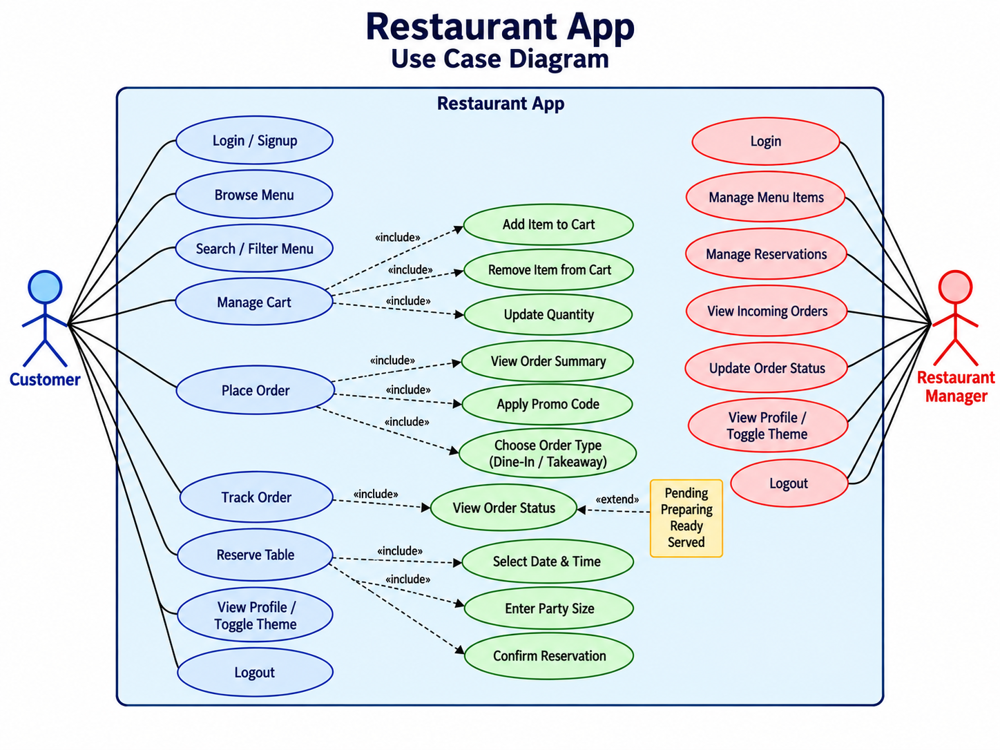
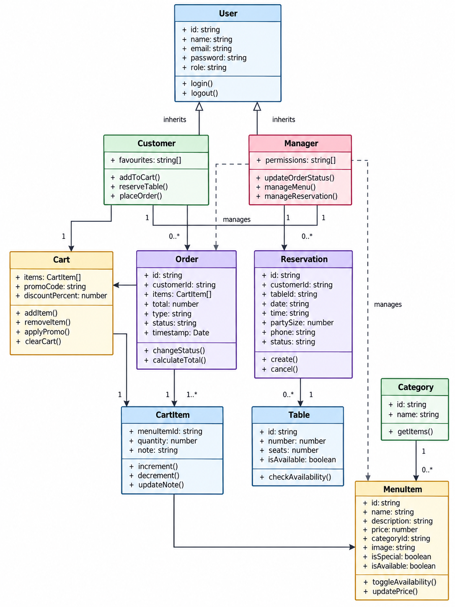
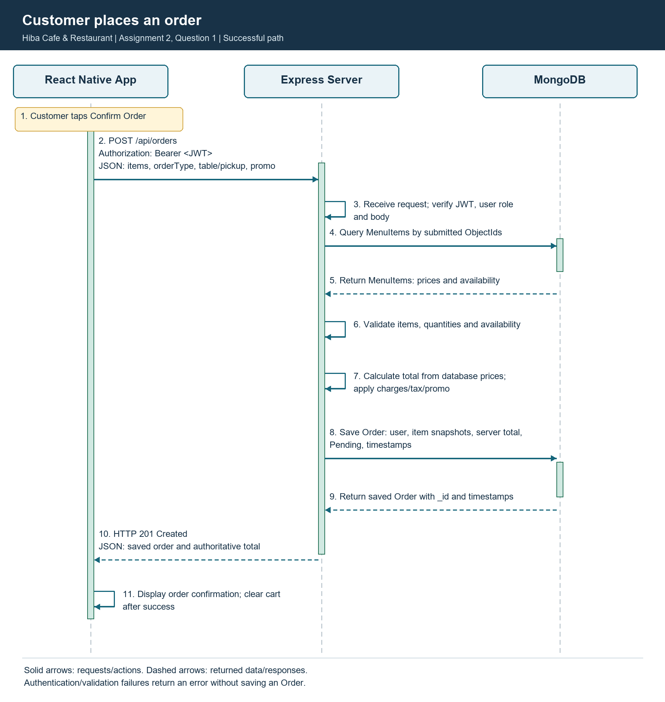
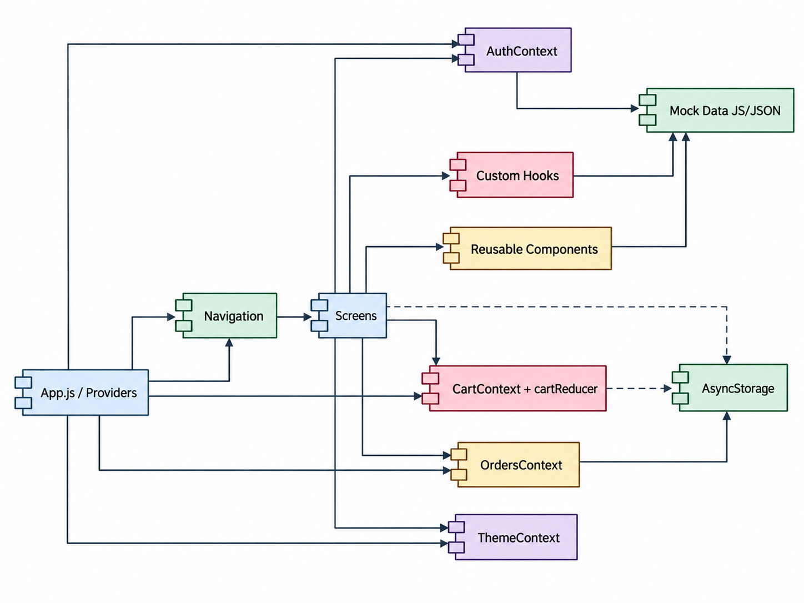
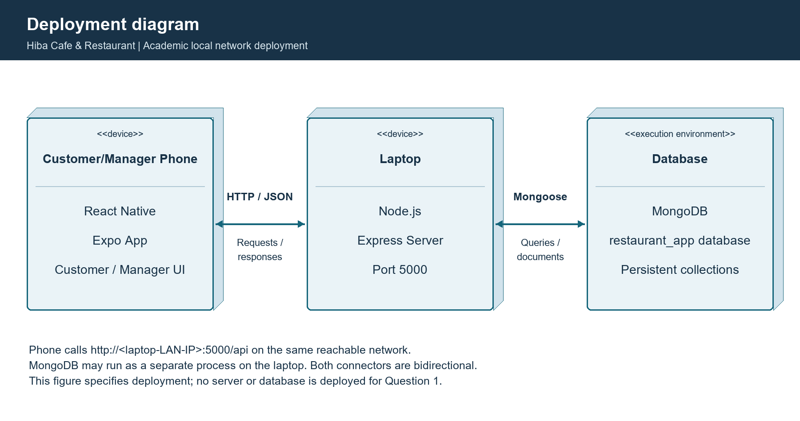

# Hiba Cafe & Restaurant
## Software Requirements Specification (SRS) — Version 2.0

Assignment 2 — Question 1: SRS Update and API Design  
Student: Murad Khan | Registration No.: 9256 | Fall 2026  
Date: 2 October 2026  
Repository: https://github.com/MURAD-KHAN1/restaurant-app-mvp

This is the proposed backend-enabled evolution of the existing A1 Restaurant App MVP, a requirements/design deliverable only. Backend APIs and integration are not claimed as implemented. All original files remain unchanged. No Assignment 2 Questions 2–7 coding is included.

## 1. Introduction

### 1.1 Purpose

This SRS defines Hiba Cafe & Restaurant v2 for the instructor, developer and reviewers. It retains A1's customer/manager interfaces, hooks, cart, navigation and themes while designing a Node.js/Express REST backend with MongoDB. Sections 1–7 and FR-01–FR-35 keep their numbering; section 5 becomes Database Design and section 8 adds API Endpoints. Backend statements are target requirements; the unchanged A1 application remains local.

### 1.2 Scope

Customers browse/search/filter the menu, manage quantities/notes/promos, reserve tables, order Dine-in/Takeaway and track status. Managers manage orders, reservations, prices and availability. The same React Native Expo client is retained.

In scope:

- Existing role-based navigation, customer/manager screens, daily specials, categories, sorting, favourites, recent searches, refresh, cart badge and light/dark themes.
- Node.js backend, Express server on port 5000, REST APIs using JSON, MongoDB restaurant_app database and Mongoose data access.
- Shared centralized Users, MenuItems, Tables, Orders and Reservations; persistent menu data, orders and reservations.
- Authentication with password hashes/JWTs, server roles/ownership, server-side validation, authoritative totals, booking conflict prevention and order lifecycle checks.
- Multi-device updates using API reads. Active order/manager screens poll every 10 seconds while focused and refresh on focus. Menu/reservation screens refresh on focus/pull-to-refresh. Stop polling on blur/background.
- Local deployment design: phone, laptop Express server and database.

Out of scope:

- Real online payments and payment gateway integration.
- Push notifications.
- Production cloud/high-availability infrastructure, production TLS provisioning, third-party cloud identity and instantaneous socket synchronization. Hashing/JWT/input validation remain in scope. Academic LAN HTTP is specified; a future public deployment needs HTTPS.

#### 1.2.1 A1 Problems and A2 Solutions

| No. | A1 problem and evidence | A2 server/database solution |
| --- | --- | --- |
| 1 | Menu data is local/mock in src/data/menu.js. | MongoDB MenuItems is authoritative; GET /api/menu and /api/menu/:id return current data. A1's 20 items become proposed initial data. |
| 2 | Price edits affect RestaurantContext/AsyncStorage on the same phone. | Manager PUT /api/menu/:id persists prices; all phones retrieve edits on refresh. |
| 3 | Availability edits are local isAvailable state. | Persist available centrally and recheck MongoDB availability when ordering. |
| 4 | Orders are local under @restaurant/orders. | POST /api/orders saves Orders with user references and timestamps. |
| 5 | Orders cannot automatically appear on another phone. | Active manager GET /api/orders polling retrieves new shared orders every 10 seconds; customers read /my. |
| 6 | Reservations are local under @restaurant/reservations. | POST reservations persists shared records for customer/manager reads. |
| 7 | Two users may see inconsistent bookings and reserve the same slot. | Server checks capacity/time; active-slot unique index rejects competing table/date/time bookings with 409. |
| 8 | Removing local app data can erase important records. | MongoDB retains data outside the phone; refetch after login. Database failures still require backups. |
| 9 | OrdersContext uses fake 10/20/30-second status timers. | Managers update validated server status; polling reads it. Elapsed timer is display-only. |
| 10 | AuthContext uses mockUsers/sessionUsers and plaintext comparisons. | Persistent Users, password hashes and verified expiring JWTs replace mock login. Public signup cannot grant manager. |
| 11 | OrderSummaryScreen calculates total only in the app. | Server uses MongoDB prices and trusted promo rules to calculate charges/tax/discount/total. Client is a preview. |
| 12 | Phones do not share one source of data. | All use one Express API and restaurant_app database; contexts/reducers hold UI/cache state. |

### 1.3 Definitions and Acronyms

| Term | Definition |
| --- | --- |
| SRS | Software Requirements Specification: defines required behavior and constraints. |
| MVP | Minimum Viable Product: smallest working version demonstrating required features. |
| UML | Unified Modeling Language: notation for actors, entities, flows and deployment. |
| Hook | React function adding state, effects or reusable component behavior. |
| Context | Shares React values without passing props through every level. |
| Reducer | Pure function returning new state from state and an action. |
| Mock Data | Sample local records used before a backend exists. |
| FlatList | React Native component efficiently rendering scrollable lists. |
| AsyncStorage | Device-local key-value storage, not a shared database. |
| Debounce | Delays an action until input stops changing for an interval. |
| API | Application Programming Interface: agreed way to request server services/data. |
| REST | Representational State Transfer: API style using resource URLs and HTTP methods. |
| Endpoint | Method and URL combination exposing one API operation. |
| JSON | JavaScript Object Notation: text format for structured data exchange. |
| MongoDB | Database storing documents grouped into collections. |
| Collection | Named group of related MongoDB documents, similar in purpose to a table. |
| Mongoose | Node.js library for schemas, document validation and MongoDB access. |
| Middleware | Express functions processing requests before handlers, e.g. authentication. |
| JWT | JSON Web Token: signed token identifying a user; verify signature and expiry. |
| HTTP Status Code | Response number describing results, e.g. 201 created or 401 unauthenticated. |
| ObjectId | MongoDB document identifier type, also used for references. |
| Index | Database structure supporting lookups and unique-value enforcement. |
| Polling | Repeated API reads to retrieve shared updates. |

## 2. Overall Description

### 2.1 User Roles

| Role | Permissions and goals |
| --- | --- |
| Customer / Diner | Register/login, browse/search, manage cart/promos, place/read own orders, create/read/cancel eligible own reservations, favourites/profile/theme/logout. |
| Restaurant Manager | Login, view all orders/reservations, update statuses, accept/decline bookings, add/update/delete menu items, profile/theme/logout. |

Public signup assigns customer. Managers are provisioned by a trusted administrator outside public registration. Stored database role controls API permissions; navigation alone grants no access. Both roles can read public menu data; customer creation routes require customer role.

### 2.2 Customer Self-Interview

I would download the app if it saves time, shows accurate prices/availability, finds food quickly, reserves tables and explains the bill. Tracking should reflect restaurant activity, bookings should agree across phones, and dark mode, favourites, recent searches and “no onions” notes remain useful.

### 2.3 User Stories

1. Customer: browse shared current prices/availability to choose food before arrival.
2. Customer: search dishes to find food quickly.
3. Customer: filter categories to focus on food types.
4. Customer: favourite dishes to find them again.
5. Customer: reserve against shared availability to avoid waiting.
6. Customer: add item notes to express preferences.
7. Customer: apply valid promos to see discounts.
8. Customer: see server-validated subtotal/charges/tax/discount/total.
9. Customer: track actual stored preparation status.
10. Customer: switch light/dark themes for comfort.
11. Manager: view incoming orders from all customer phones.
12. Manager: accept/decline shared bookings.
13. Manager: propagate price/availability edits on refresh.
14. Manager: update status so customers retrieve progress.

## 3. Functional Requirements

### 3.1 Authentication

- FR-01. Retain Login/Signup modes on one screen.
- FR-02. Client/server validate email and password ≥8 characters with a digit. Client requires matching confirmation; do not store confirmation.
- FR-03. Verify hashed persistent Users and issue JWT instead of mock lookup/simulated delay.
- FR-04. Route customers to Menu and managers to Dashboard using returned role.
- FR-05. AuthContext holds public user/token; logout clears session and returns to Login. Token lifetime: one day (24 hours), then login again; no refresh-token/server logout endpoint.

### 3.2 Menu

- FR-06. Fetch at least 15 items across Starters, Mains, Desserts and Drinks; A1 provides 20 initial items.
- FR-07. FlatList shows name/description/price/image/category/availability/special.
- FR-08. Grey out unavailable cards, disable Add; server independently rejects ordering.
- FR-09. GET menu category filter; retain client price/name sorting.
- FR-10. Favourite toggles remain local UI state.

### 3.3 Search

- FR-11. GET /api/menu?search=burger matches menu item names case-insensitively; category/search combine with AND.
- FR-12. Debounce input 400 ms before querying.
- FR-13. Retain five non-duplicate recent terms locally.
- FR-14. Show Back to Top after scroll exceeds 300 pixels.
- FR-15. Distinguish empty results from network errors using loading/error/Retry UI.

### 3.4 Cart

- FR-16. Add available items locally; server rechecks at submission.
- FR-17. Retain quantity/removal actions; submitted quantities are integers ≥1.
- FR-18. Save item notes with orders.
- FR-19. Retain WELCOME10 (10%) and FEAST20 (20%); server owns validation and ignores client rates.
- FR-20. Cart badge sums quantities.

### 3.5 Reservation

- FR-21. Hourly 12:00–22:00 slots in Asia/Karachi.
- FR-22. Disable slots without a suitable operational table using shared server data.
- FR-23. Server validates calendar date, party 1–12, sufficient seats, phone 03XX-XXXXXXX and start ≥1 hour ahead.
- FR-24. Confirm before creation/cancellation of own future Pending/Accepted booking; show success only after server acknowledgement; conflicts return 409.

### 3.6 Orders

- FR-25. Dine-in needs table; Takeaway needs pickup time.
- FR-26. Server calculates MongoDB-price subtotal, 5% service, 15% tax, promo discount and total; client is preview only.
- FR-27. Persist ObjectId/user/items/totals/orderType/Pending/timestamps; return 201 after save.
- FR-28. Manager updates move Pending → Preparing → Ready → Served. Cancelled only while Pending; no status-changing local timers.
- FR-29. Show API status/progress and elapsed time from createdAt; poll GET /api/orders/my every 10 seconds while focused.

### 3.7 Manager Dashboard

- FR-30. Server middleware independently enforces manager access.
- FR-31. Status PATCH validates transitions with atomic current-status matching.
- FR-32. Manager accepts/declines Pending reservations.
- FR-33. Add/update menu price/availability; delete unreferenced items via manager APIs.
- FR-34. Persist edits centrally, visible to all phones on next refresh.
- FR-35. MongoDB persists users/menu/tables/orders/reservations; refetch at startup/login. AsyncStorage may cache but is not authoritative.

## 4. Non-Functional Requirements

| Area | Requirement |
| --- | --- |
| Usability | Clear labels/text, validation/loading/error/Retry/disabled states and confirmations after acknowledgement. |
| Performance | FlatList and memoized derived data; target 95% ordinary API reads <1 second on test LAN/A1-sized data, measured during implementation. Client timeout 10 seconds; no silent write retries. |
| Responsiveness | Safe Area, common phone layouts, unclipped portrait Expo use. |
| Maintainability | Preserve components/screens/context/reducers/hooks/data/navigation; future backend separates routing/auth/validation/data access. No Q1 implementation. |
| Data Handling | MongoDB is authoritative; validate/save before responding. Use integer paisa arithmetic and two-decimal PKR. |
| Reliability | Invalid requests create nothing; indexes resolve duplicate races, conditional updates prevent lost status changes, polling/timers clean up. |
| Security | bcrypt cost 12 hashes, never return passwords. Verify JWT/current user/role, ownership and allowlisted fields. Reject raw database operators; keep server secrets outside app. |
| Accessibility | Descriptive labels, adequate touch areas and text accompanying status colours. |
| Compatibility | Preserve Expo/React Native and React Navigation flows; phone/laptop share a reachable LAN. |

## 5. Database Design

### 5.1 Conventions and Relationships

Database: restaurant_app. Specify collection names Users, MenuItems, Tables, Reservations and Orders explicitly in future Mongoose configuration. Every document has a required unique generated ObjectId _id. Required strings are non-empty after trimming. No uniqueness applies unless stated. None means no default or extra enum/minimum. All five collections use server-managed createdAt/updatedAt BSON Dates with Mongoose timestamps enabled, including required Reservations/Orders timestamps.

API ObjectIds are 24-character hex strings; timestamps are UTC ISO 8601. Reservation date/time are local strings interpreted in Asia/Karachi. Mongoose references do not enforce foreign keys: the service checks referenced records exist. IDs/timestamps/owners/public-registration role/item snapshots/totals are protected server fields.

- User 1 → 0..many Orders/Reservations through user ObjectId references.
- Table 1 → 0..many Reservations over time. Each booking references one Table. Dine-in Order references one Table; Takeaway has none.
- Order embeds 1..many items; items.menuItem references MenuItems using ObjectId. One MenuItem can occur in many orders.
- Category is an enum, not another collection. Cart/favourites/search/theme remain local UI. Trusted server configuration owns WELCOME10/FEAST20 rules.

### 5.2 Users

| Field | Data type | Required | Unique | Default | Enum / minimum / validation |
| --- | --- | --- | --- | --- | --- |
| _id | ObjectId | Yes | Yes | Generated | Identifier |
| name | String | Yes | No | None | Trim, non-empty |
| email | String | Yes | Yes | None | Valid email, lowercase/trim, unique database index |
| password | String | Yes | No | None | bcrypt hash only; input ≥8 characters and a digit; omit from responses |
| role | String | Yes | No | customer | Enum customer, manager; public signup assigns customer |
| createdAt | Date | Yes | No | Server now | timestamps enabled |
| updatedAt | Date | Yes | No | Server now | Updated on changes |

Orders.user and Reservations.user reference Users. No public user deletion endpoint; referenced users cannot be hard-deleted. A database unique email index resolves simultaneous registrations, rather than a pre-check alone.

### 5.3 MenuItems

| Field | Data type | Required | Unique | Default | Enum / minimum / validation |
| --- | --- | --- | --- | --- | --- |
| _id | ObjectId | Yes | Yes | Generated | Order item reference target |
| name | String | Yes | No | None | Trim, non-empty |
| description | String | No | No | Empty string | Descriptive text |
| category | String | Yes | No | None | Starters, Mains, Desserts, Drinks; All is UI-only |
| price | Number | Yes | No | None | Minimum 0, finite PKR, ≤2 decimal places |
| image | String | No | No | Empty string | Approved URL/path or stable asset key; no numeric require() handle |
| available | Boolean | Yes | No | true | false blocks new orders |
| isSpecial | Boolean | No | No | false | Preserves A1 specials |
| createdAt | Date | Yes | No | Server now | timestamps enabled |
| updatedAt | Date | Yes | No | Server now | Updated on changes |

A1 id maps to _id and isAvailable to available; images map to stable keys/URLs. Save order name/unitPrice snapshots so later edits do not change history. DELETE returns 409 for items referenced by orders; manager can set available=false instead. Future deletion/order creation must serialize against each other to prevent dangling references (e.g. transactions with a shared menu-document write lock). This is a design rule, not supplied server code.

### 5.4 Tables

| Field | Data type | Required | Unique | Default | Enum / minimum / validation |
| --- | --- | --- | --- | --- | --- |
| _id | ObjectId | Yes | Yes | Generated | Reservation/Order reference target |
| tableNumber | Number | Yes | Yes | None | Integer minimum 1, unique index |
| seats | Number | Yes | No | None | Integer minimum 1 |
| available | Boolean | Yes | No | true | Operational flag, not slot occupancy |
| name | String | No | No | Empty string | A1 table labels |
| area | String | No | No | Empty string | A1 seating areas |
| createdAt | Date | Yes | No | Server now | timestamps enabled |
| updatedAt | Date | Yes | No | Server now | Updated on changes |

A1's six tables have seats 2,4,4,6,8,12. tableNumber is distinct from old T1–T6 identifiers. Tables have many reservations over time. No table-edit/delete endpoint is required here.

### 5.5 Reservations

| Field | Data type | Required | Unique | Default | Enum / minimum / validation |
| --- | --- | --- | --- | --- | --- |
| _id | ObjectId | Yes | Yes | Generated | Identifier |
| user | ObjectId → Users | Yes | No | JWT user | Existing customer; no client owner |
| table | ObjectId → Tables | Yes | Compound active-slot | None | Existing operational table, sufficient seats |
| date | String | Yes | Compound active-slot | None | Valid YYYY-MM-DD, Asia/Karachi; not past |
| time | String | Yes | Compound active-slot | None | Hourly HH:mm 12:00–22:00; ≥1 hour ahead |
| partySize | Number | Yes | No | None | Integer minimum 1, maximum 12, ≤ seats |
| phone | String | Yes | No | None | Pattern ^03[0-9]{2}-[0-9]{7}$ |
| status | String | Yes | No | Pending | Pending, Accepted, Declined, Cancelled |
| createdAt | Date | Yes | No | Server now | timestamps enabled |
| updatedAt | Date | Yes | No | Server now | timestamps enabled |

A booking occupies one hourly slot [time,time+1 hour). Pending/Accepted both reserve capacity. Use unique compound index {table:1,date:1,time:1}, partialFilterExpression {status:{$in:["Pending","Accepted"]}}. Only active bookings participate; Declined/Cancelled preserve history and release the slot. Build index before accepting writes. Pre-check for helpful feedback, but the index resolves concurrent writes; duplicate keys become 409. Design targets MongoDB 6.0+ supporting $in in partial indexes.

Manager: Pending → Accepted/Declined. Customer: own future Pending/Accepted → Cancelled. Declined/Cancelled are terminal; no resurrection or date/table edits. Atomically match old status during updates; racing changes return 409. GET tables slot queries derive occupancy from shared active bookings and operational flags.

### 5.6 Orders

| Field | Data type | Required | Unique | Default | Enum / minimum / validation |
| --- | --- | --- | --- | --- | --- |
| _id | ObjectId | Yes | Yes | Generated | Identifier |
| user | ObjectId → Users | Yes | No | JWT user | Existing authenticated customer |
| items | Embedded array | Yes | No | None | At least one item; reject duplicate menuItem refs |
| items.menuItem | ObjectId → MenuItems | Each item | No | None | Existing/available at placement |
| items.quantity | Number | Each item | No | None | Integer minimum 1 |
| items.note | String | No | No | Empty string | Maximum 500 characters |
| items.name | String | Each item | No | Database name | Server snapshot |
| items.unitPrice | Number | Each item | No | Database price | Minimum 0, server snapshot |
| subtotal | Number | Yes | No | Server calculated | Minimum 0, sum unitPrice × quantity |
| serviceCharge | Number | Yes | No | Server calculated | Minimum 0, 5% subtotal |
| salesTax | Number | Yes | No | Server calculated | Minimum 0, 15% subtotal |
| discount | Number | Yes | No | Server calculated | Minimum 0, valid promo percentage × subtotal |
| total | Number | Yes | No | Server calculated | Minimum 0, subtotal + service + tax − discount |
| promoCode | String | No | No | Empty string | Empty, WELCOME10, FEAST20 |
| orderType | String | Yes | No | None | Dine-in, Takeaway |
| table | ObjectId → Tables / null | Dine-in only | No | null | Existing available table; null for Takeaway |
| pickupTime | String / null | Takeaway only | No | null | 15 minutes, 30 minutes, 45 minutes, 60 minutes; null for Dine-in |
| status | String | Yes | No | Pending | Pending, Preparing, Ready, Served, Cancelled |
| createdAt | Date | Yes | No | Server now | timestamps enabled |
| updatedAt | Date | Yes | No | Server now | timestamps enabled |

Server queries MongoDB MenuItems, rejects missing/unavailable items, checks quantities and calculates total using database prices. Client owner/unitPrice/total/status are prohibited. Snapshots preserve totals after menu edits. Calculate in integer paisa; round each charge/discount to nearest paisa before storing PKR values.

A1 example: 2 Classic Smash Burgers × PKR 1,390 = subtotal 2,780; service 139; tax 417; WELCOME10 discount 278; total PKR 3,058. Server values override stale previews.

Normal progression: Pending → Preparing → Ready → Served, one step per update. Cancelled is allowed only while Pending. Served/Cancelled are terminal. Skip/backward/repeated/Preparing → Cancelled updates return HTTP 400 with a message explaining the invalid order status transition. Managers alone update orders. Atomic update matches _id and current status; add user/createdAt indexes for Order/Reservation history.

## 6. UML Diagrams

### Figure 1. Use Case Diagram — A1 Baseline Retained

A1 actors/goals remain. Authentication/menu/order/booking actions become server-backed. Original image reproduced unchanged as a baseline.

### Figure 2. Class Diagram — A1 Baseline Retained

This models client entities, not the v2 schema. Section 5 replaces string references with ObjectIds, uses role-based Users, embeds order items and stores category as enum.

### Figure 3. Updated Sequence Diagram — Customer Places an Order

Exactly three lifelines: React Native App, Express Server, MongoDB. Customer action is a note, not another lifeline. App POST /api/orders sends Bearer JWT; server receives/verifies request, queries MenuItems, receives prices/availability, validates items, calculates total, saves Order and receives the saved document. HTTP 201 precedes app confirmation/cart clear. Diagram shows success; failures return section 8 errors without saving.

### Figure 4. Order Lifecycle — Updated A1 Interpretation

Pending → Preparing → Ready → Served; Pending → Cancelled. A1/UML/state-machine-diagram.png is unchanged, but timers and cancellation from Preparing are superseded in v2 by section 5.6. Only server-validated manager updates change status.

### Figure 5. Component Diagram — A1 Baseline Retained

App.js still composes providers/navigation. Baseline shows local/planned storage, not evidence that every preference persists: actual AuthContext is session-local and ThemeContext in-memory. Proposed Auth/Orders/Restaurant data path: App → Express API → Mongoose → MongoDB. Cart/favourites/search/theme remain local UI concerns.

### Figure 6. Deployment Diagram

Customer/Manager Phone runs React Native and Expo App; laptop runs Node.js/Express on port 5000. HTTP/JSON connects phone/server; Mongoose connects Express/MongoDB restaurant_app. MongoDB may be a separate process on the same laptop. Phone uses laptop LAN IP, e.g. http://192.168.1.10:5000/api, not phone localhost. Design only; no deployment is performed.

## 7. MVP Frontend Development (React Native)

Existing screen numbers are retained. Future integration is specified, not implemented. Current React Navigation, contexts, reducers and custom hooks remain unchanged.

### 7.1 Login and Signup Screen

Purpose: authenticate/register a customer. Keep toggle/name/email/password/confirmation/visibility/errors/loading. Entry app start/logout; exit Menu/Dashboard. POST register/login replaces mocks. Public role choice cannot grant manager. useState/useForm controls input; AuthContext holds public user/token.

### 7.2 Menu Browsing Screen

Purpose: browse categories/specials/availability/favourites. Keep chips, FlatList/cards, heart/Add, refresh/loading/error/Retry. Entry login/Menu; exit Cart/Profile/Reserve. GET menu supplies data; useEffect reads/cleans up, useMemo sorts, useCallback stabilizes handlers. Refresh on focus.

### 7.3 Search and Scroll Controls

Purpose: find dishes/navigate lists. Keep input/clear/recent terms/counter/Back to Top/empty UI. useRef controls input/list/diagnostics; useDebounce delays 400 ms. Send category/search API query; ignore stale responses. Five terms remain local.

### 7.4 Profile and Theme Screen

Purpose: details/theme/logout. Keep name/email/role/switch/logout. Entry Profile; exit tabs/Login. useAuth supplies public user, useTheme palettes. Logout clears session; theme needs no collection.

### 7.5 Cart Screen

Purpose: manage dishes/notes. Keep quantities/removal/notes/promos/preview. Entry Cart/Add; exit Menu/Summary. CartContext/cartReducer retains ADD_ITEM, REMOVE_ITEM, INCREMENT, DECREMENT, UPDATE_NOTE, CLEAR_CART, APPLY_PROMO, REMOVE_PROMO. Local draft checked by server at checkout.

### 7.6 Order Summary Screen

Purpose: preview/place order. Keep item/totals/type/table/pickup UI. Entry Cart; exit Orders after 201 or back. useMemo previews totals; POST returns final values. Disable repeated submission taps; retain cart on failure, clear on acknowledgement. Explain that fresh database prices can change the preview.

### 7.7 Table Reservation Screen

Purpose: shared booking/cancellation. Keep date/slots/party/table/phone/confirmation/My Reservations. GET tables with slot filters and GET reservations/my supplies data; POST creates, PATCH cancels eligible own bookings. useReservation/useForm manages draft/UI validation; server repeats checks. Refresh/explain 409 conflicts.

### 7.8 Order Tracking and Manager Dashboard

Purpose: progress and restaurant management. Keep steps/elapsed label and Incoming Orders/Reservations/Menu Management. Customer GET /api/orders/my; manager GET orders/reservations plus mutations. useEffect polls focused views every 10 seconds with cleanup; ordersReducer holds fetched UI without timer progression. RestaurantContext displays API menu/bookings; server persists them.

## 8. API Endpoints

### 8.1 Common Contract

Local base URL: http://<laptop-LAN-IP>:5000/api. JSON uses Content-Type: application/json. Protected routes require Authorization: Bearer <JWT>. Middleware verifies signature, one-day (24-hour) expiry and current stored user/role. Public needs no token; Customer requires customer; Manager requires manager; authenticated user permits either. /my derives owner from JWT, never request body/query. Server enforces role/ownership independently of navigation.

ObjectIds serialize as hex strings; timestamps as UTC ISO 8601. Unknown/protected fields return 400. GET/DELETE bodies are None. Success uses {data:...}, except health. Errors use {error:{code,message,fields?}}; omit passwords/database internals. Register/login returns only the caller's JWT. Order/reservation lists accept page (default 1) and limit (default 20, max 100); return {data:[...],page,limit,total} newest first. Register /my before any future /:id read route.

### 8.2 Endpoint Table

| Method | Endpoint | Access | Request Body | Response |
| --- | --- | --- | --- | --- |
| POST | /api/auth/register | Public | {name,email,password}; role prohibited | 201 {data:{user:{_id,name,email,role},token,expiresIn:86400}}; 400 invalid; 409 duplicate email |
| POST | /api/auth/login | Public | {email,password} | 200 {data:{user:{_id,name,email,role},token,expiresIn:86400}}; 400 malformed; 401 bad credentials |
| GET | /api/menu | Public | None; category?/search? query | 200 {data:[MenuItem]}; 400 invalid query |
| GET | /api/menu/:id | Public | None | 200 {data:MenuItem}; 400 invalid id; 404 missing |
| POST | /api/menu | Manager | {name,category,price,description?,image?,available?,isSpecial?} | 201 {data:MenuItem}; 400 validation |
| PUT | /api/menu/:id | Manager | {name,category,price,description?,image?,available?,isSpecial?}; replacement | 200 {data:MenuItem}; 400 invalid; 404 missing |
| DELETE | /api/menu/:id | Manager | None | 204 no body; 404 missing; 409 referenced by order |
| GET | /api/tables | Customer / authenticated user (either role) | None; date?,time?,partySize? together | 200 {data:[Table with slotAvailable if queried]}; 400 query |
| POST | /api/orders | Customer / authenticated customer | {items:[{menuItem,quantity,note?}],orderType,table?,pickupTime?,promoCode?} | 201 {data:Order with server totals}; 400 invalid/missing refs; 409 unavailable |
| GET | /api/orders/my | Customer / authenticated customer | None; page?,limit? query | 200 own paginated Orders |
| GET | /api/orders | Manager | None; page?,limit? query | 200 all paginated Orders |
| PATCH | /api/orders/:id/status | Manager | {status} | 200 {data:Order}; 400 invalid status/id or invalid/racing transition with message; 404 missing |
| POST | /api/reservations | Customer / authenticated customer | {table,date,time,partySize,phone} | 201 {data:Reservation}; 400 invalid/missing refs; 409 unavailable/taken |
| GET | /api/reservations/my | Customer / authenticated customer | None; page?,limit? query | 200 own paginated Reservations |
| GET | /api/reservations | Manager | None; page?,limit? query | 200 all paginated Reservations |
| PATCH | /api/reservations/:id | Manager; Customer own cancellation only | {status}; manager Accepted/Declined; customer Cancelled | 200 {data:Reservation}; 400 invalid; 403 owner/role; 404 missing; 409 transition |
| GET | /api/health | Public | None | HTTP 200 {"status":"ok","time":"<current ISO time>"}; time generated dynamically for each request, with no database status requirement |

All protected routes also return 401 absent/invalid/expired JWT or 403 insufficient role/ownership. Every :id needs a valid ObjectId (400); valid but absent resource returns 404. PUT requires name/category/price; omitted optional writable fields reset to defaults. No _id/timestamp changes. Table reads without filters list operational flags/capacities; with all three filters slotAvailable combines operational flag, capacity and no active booking. Availability read cannot guarantee creation: the unique index decides.

### 8.3 Menu Filtering and Search

GET /api/menu?category=Mains returns only Mains. GET /api/menu?search=burger matches menu item names case-insensitively; BURGER equals burger. GET /api/menu?category=Mains&search=burger combines filters. Search is literal text, not executable regex/operators: escape metacharacters if using regex and enable case-insensitive matching. Limit trimmed search to 100 characters. No filters returns all items, including available=false cards. Unsupported category returns 400; no matches returns 200 {data:[]}.

### 8.4 Example and Error Rules

POST /api/orders with Authorization: Bearer <JWT>. ObjectIds below are illustrative and must reference real records in implementation.

Request: {"items":[{"menuItem":"507f1f77bcf86cd799439011","quantity":2,"note":"No onions"}],"orderType":"Takeaway","pickupTime":"30 minutes","promoCode":"WELCOME10"}.

Response HTTP 201: {"data":{"_id":"507f1f77bcf86cd799439012","user":"507f1f77bcf86cd799439013","items":[{"menuItem":"507f1f77bcf86cd799439011","quantity":2,"note":"No onions","name":"Classic Smash Burger","unitPrice":1390}],"subtotal":2780,"serviceCharge":139,"salesTax":417,"discount":278,"total":3058,"promoCode":"WELCOME10","orderType":"Takeaway","table":null,"pickupTime":"30 minutes","status":"Pending","createdAt":"2026-10-02T16:00:00Z","updatedAt":"2026-10-02T16:00:00Z"}}.

HTTP 409 example: {"error":{"code":"ITEM_UNAVAILABLE","message":"An item is no longer available."}}; no order saved, cart retained, refresh offered. Bad quantities/empty items/unknown promo/type-table-pickup conflicts/missing references return 400. Client user/total/unitPrice/status prohibited. Manager creating customer records returns 403; customer updating another's booking returns 403. Invalid or racing order status transitions return HTTP 400 with a message; reservation status races/occupied slots remain HTTP 409. Unexpected faults use generic 500; database unavailable uses 503. Do not automatically retry uncertain writes: refresh history first.

## Appendix A: Required Implementation Notes — A1 Continuity

### A.1 Filtering useEffect Dependency Note (A1 Q4)

Empty dependencies run only once. Include selectedCategory/menu when used; useMemo derives local sorting. Future reads depend on category/debounced search and ignore stale responses.

### A.2 Context vs Prop Drilling (A1 Q6)

Context supplies auth/theme/UI values without forwarding unrelated props. Consumers can re-render, so keep values focused. Context shares within one app; API/database shares across phones.

### A.3 useReducer vs useState for Cart (A1 Q7)

Pure reducer actions centralize quantities, notes, promos and removal. useState suits isolated fields. Reducers manage UI; server validates orders.

### A.4 Reducer Test Cases (A1 Q7)

| Action | Initial state | Expected UI state |
| --- | --- | --- |
| ADD_ITEM | Empty; available item | Quantity 1, empty note |
| INCREMENT | Quantity 1 | Quantity 2 |
| DECREMENT | Quantity 1 | Removed |
| UPDATE_NOTE | Empty note | Entered instructions |
| APPLY_PROMO WELCOME10 | Discount 0 | Preview 10%; server still validates |
| REMOVE_PROMO | Discount 10% | Empty promo, discount 0 |
| CLEAR_CART | Items exist | Empty cart/promo after acknowledged order |

### A.5 When Not to Use useMemo/useCallback (A1 Q8)

Memoization costs bookkeeping; use for expensive derived values or stable handlers with observed benefits. Simple calculations/handlers do not require it automatically. These retained A1 notes are documentation only.

## Appendix B: Inspection and Traceability

### B.1 Inspected Sources

- A1/SRS.pdf: all 13 pages, sections 1–7, FR-01–FR-35 and Appendix A; identity/numbering retained.
- README.md/package.json: Hiba Cafe & Restaurant, Expo SDK 57, JavaScript, React Navigation, 20 menu items, promos/charges/local persistence.
- src/data/menu.js, users.js, tables.js, reservations.js, promoCodes.js: categories/availability/mock credentials/six tables/bookings/promos.
- src/context/AuthContext.js, CartContext.js, OrdersContext.js, RestaurantContext.js, ThemeContext.js: mock login/state, actual AsyncStorage domains, status timers and in-memory theme.
- src/reducers/cartReducer.js, ordersReducer.js; src/hooks/useForm.js, useDebounce.js, useReservation.js: actions/forms/debounce/booking validation.
- src/navigation/AppNavigator.js, src/screens, src/components, src/theme: role routing, customer/manager screens, summary formula and reusable UI.
- A1/UML/use-case-diagram.png, class-diagram.png, sequence-diagram.png, state-machine-diagram.png, component-diagram.png: all inspected and preserved; baseline figures labeled where superseded.

### B.2 Question 1 Coverage

| Requirement | Evidence |
| --- | --- |
| Scope, backend, excluded payments/push, 12 problems/solutions | 1.2 and 1.2.1 |
| All ten requested backend/database terms | 1.3 plus original definitions |
| Five collections/types/required/unique/default/enum/min/references | 5.1–5.6 |
| Database pricing, unavailable rejection and lifecycle | 3.6, 5.6, 8.4 |
| At least 15 endpoints with access/body/response | 8.2 includes all 17 requested |
| Category/case-insensitive search | 3.3, 8.3 |
| Exactly three order lifelines/JWT/save/201 | Section 6 Figure 3; diagrams/order-sequence-diagram.png |
| Phone/laptop/database deployment | Section 6 Figure 6; diagrams/deployment-diagram.png |
| PDF and unchanged original | A2/SRS_v2.pdf; verification report checksum comparison |
| No Questions 2–7 backend coding | Documentation/diagram generation only |

### B.3 References

Local A1 files are the authoritative baseline. Technical sources checked 2 October 2026 support validation/index concepts; API/schema details are proposed for this app.

- Project: https://github.com/MURAD-KHAN1/restaurant-app-mvp
- Mongoose required/enum/min and unique-index distinction: https://mongoosejs.com/docs/validation.html
- MongoDB partial unique indexes: https://www.mongodb.com/docs/manual/core/index-partial/
