# Saffron Table — Restaurant App MVP

## 🎥 Demo Video

[▶ Watch Restaurant App MVP Demo Video](https://drive.google.com/file/d/1PTc2ZH0ywbBaXqZ7p5TU4G0FlmrPgYw0/view?usp=drive_link)

---

## 📱 App Screenshots

### Sign Up
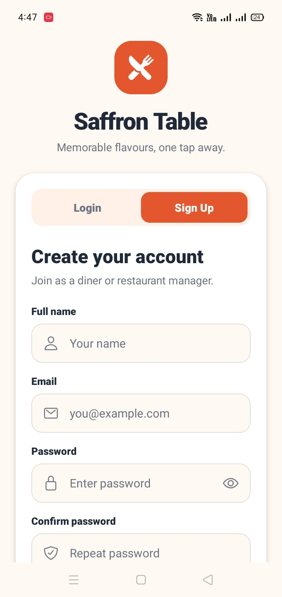

### Login
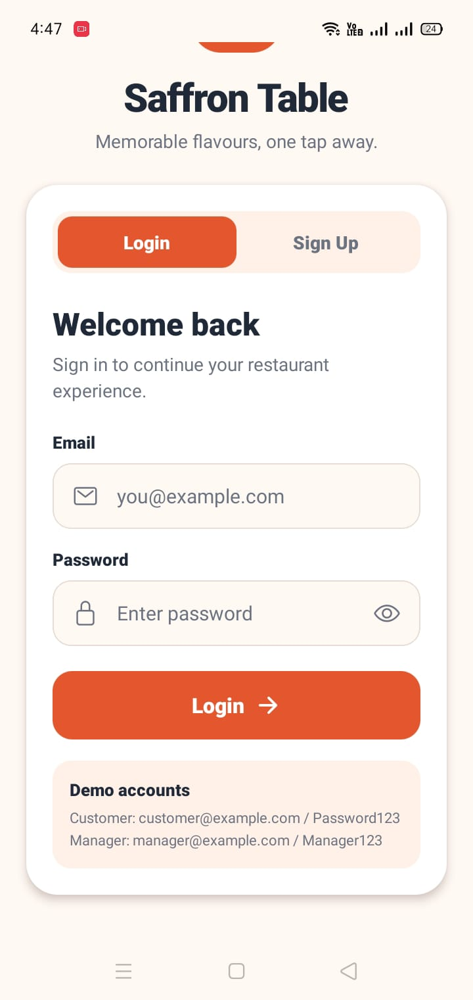

### Customer Home
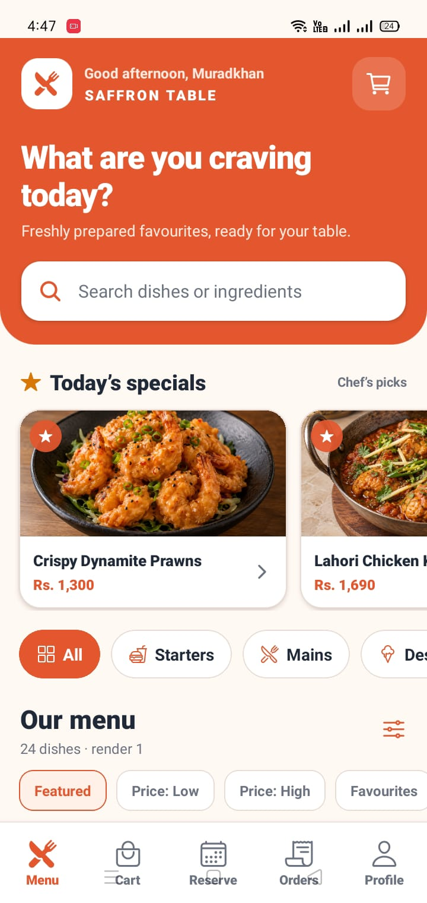

### Menu
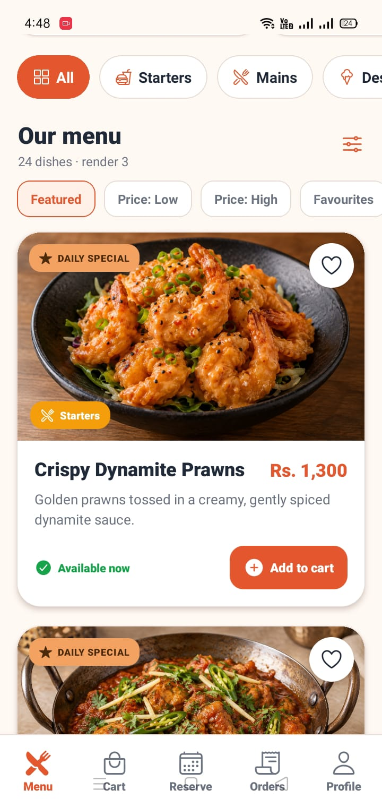

### Cart
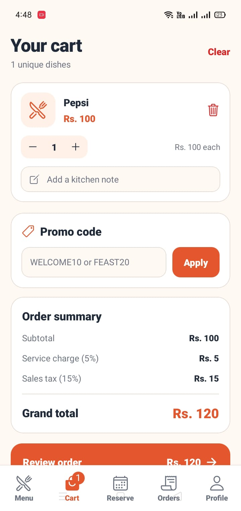

### Order Summary
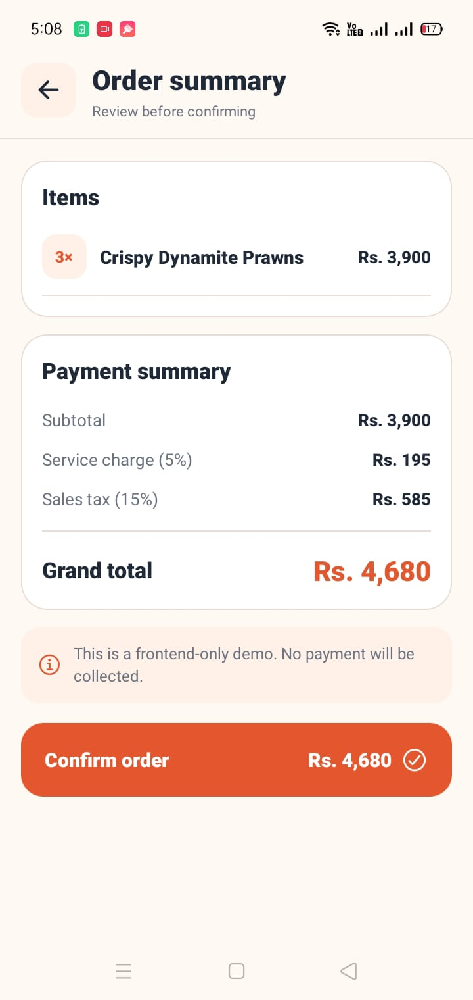

### Reservation
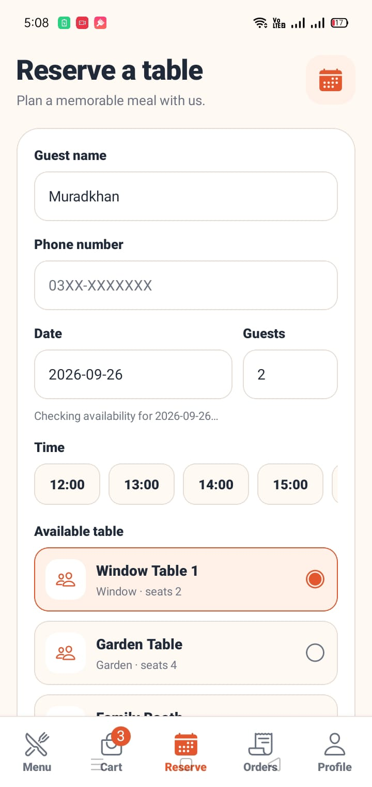

### Order Tracking
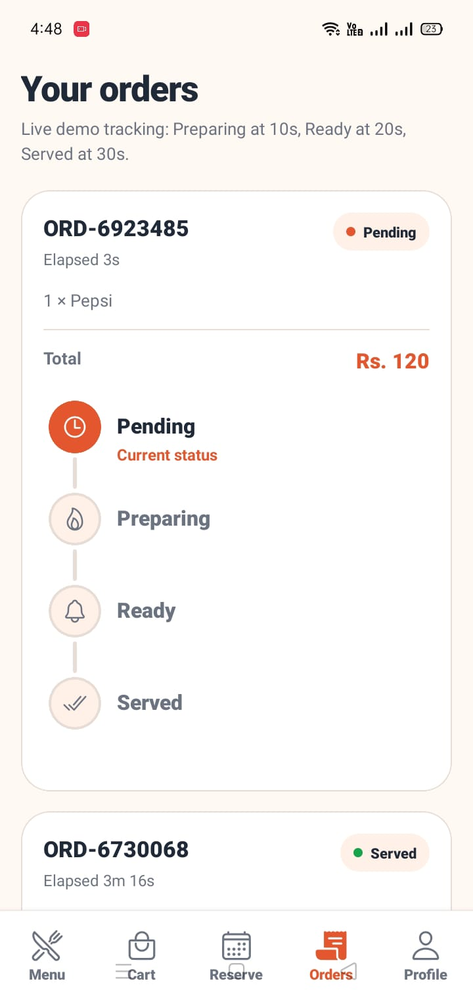

### Manager Dashboard
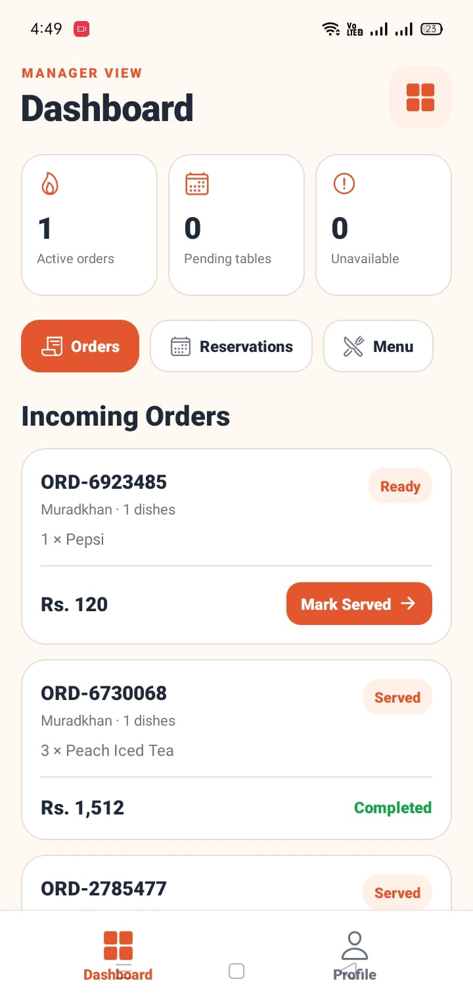

### Manager Reservations
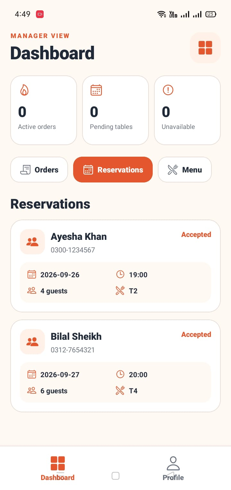

### Manager Menu Management
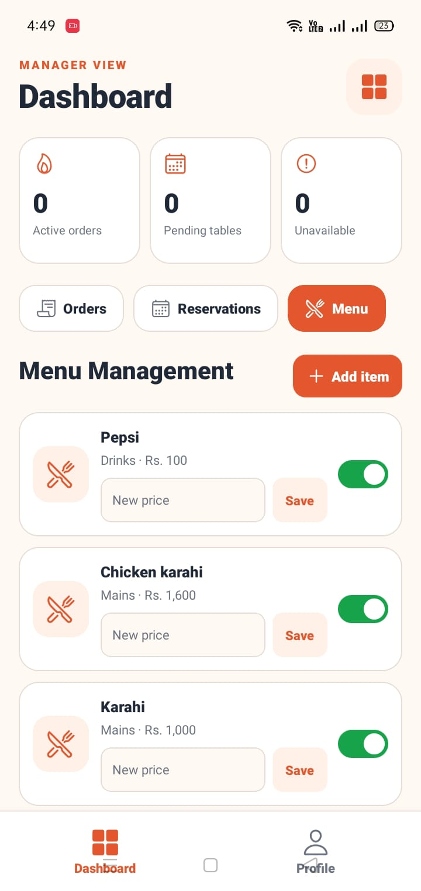

[View All Screenshots](screenshots/)

---

## About the Project

Saffron Table is a frontend-only Restaurant App developed using React Native and Expo.

The application provides separate experiences for Customers and Restaurant Managers.

It uses React Hooks, Context API, reducers, React Navigation, mock/local data, and AsyncStorage.

There is no backend, Firebase, external API, Redux, Zustand, or real payment gateway.

---

## Main Features
# Saffron Table — Restaurant App MVP

Saffron Table is a frontend-only restaurant mobile application built with **React Native and Expo**.

The app provides separate interfaces for **Customers** and **Restaurant Managers**. It uses mock/local data, React Hooks, Context API, reducers, React Navigation, and AsyncStorage.

There is **no backend, no real database, no real payment gateway, and no external API**.

---

## Technologies Used

- React Native
- Expo
- JavaScript
- React Navigation
- Context API
- React Hooks
- useReducer
- AsyncStorage
- Ionicons / Expo Vector Icons

---

## Main Features

### Customer

- Login and Sign Up
- Browse restaurant menu
- Food categories
- Search menu items
- Sort menu items
- Add favourites
- Add items to cart
- Change item quantity
- Add special instructions
- Apply promo codes
- View Order Summary
- Reserve a table
- Place Dine-In or Takeaway order
- Track order status
- Light / Dark Theme
- Profile and Logout

### Manager

- Manager Login
- View incoming orders
- Update order status
- View reservations
- Accept / Decline reservations
- Add menu items
- Edit menu prices
- Toggle item availability
- Profile and Logout

---

## Requirements

- Node.js 20.19 or newer
- npm
- Expo Go
- Android or iOS phone

---

## Installation

Open terminal in the project folder:

```powershell
cd C:\Users\LENOVO\Desktop\MAD\restaurant-app-mvp
```

Install packages:

```powershell
npm install
```

Run the app:

```powershell
npx.cmd expo start
```

Open **Expo Go** on your phone and scan the QR code.

If normal connection does not work:

```powershell
npx.cmd expo start --tunnel
```

---

## Test Login Accounts

| Role | Email | Password |
| --- | --- | --- |
| Customer | `customer@example.com` | `Password123` |
| Manager | `manager@example.com` | `Manager123` |

---

## Project Structure

```text
restaurant-app-mvp
│
├── A1
│   ├── SRS.pdf
│   └── UML
│
├── assets
│   └── menu
│
├── screenshots
│
├── src
│   ├── components
│   ├── context
│   ├── data
│   ├── hooks
│   ├── navigation
│   ├── reducers
│   ├── screens
│   └── theme
│
├── App.js
├── app.json
├── package.json
├── package-lock.json
└── README.md
```

---

## Assignment Questions 3–10

| Question | Work |
| --- | --- |
| Q3 | Login and Signup using `useState` |
| Q4 | Menu Browsing using `useState` and `useEffect` |
| Q5 | Search and Scroll Controls using `useRef` |
| Q6 | Authentication and Theme using `useContext` |
| Q7 | Cart Management using `useReducer` |
| Q8 | Order Summary using `useMemo`, `useCallback`, `React.memo` |
| Q9 | Table Reservation using Custom Hooks |
| Q10 | Order Tracking, Manager Dashboard and AsyncStorage |

---

## Question 1 - Software Requirements Specification

The complete Software Requirements Specification is available at `A1/SRS.pdf`.
It defines the frontend-only scope and the separate Customer and Manager roles.
The document covers functional requirements, non-functional requirements, the mock client-side data model, and frontend screen planning without duplicating the full SRS here.

---

## Question 2 - UML Diagrams

The existing `A1/UML` folder contains the assignment's UML deliverables:

- Use Case Diagram
- Class Diagram
- Sequence Diagram
- State Machine Diagram
- Component Diagram

---

## Hooks Used

| Hook | Purpose |
| --- | --- |
| `useState` | Forms, search, filters and local UI state |
| `useEffect` | Loading, timers and AsyncStorage |
| `useRef` | Search input, FlatList and render counter |
| `useContext` | Auth, Theme, Cart and Orders |
| `useReducer` | Cart and Order state management |
| `useMemo` | Menu filtering and total calculations |
| `useCallback` | Stable event handlers |
| `React.memo` | Reduce unnecessary component renders |
| `useForm` | Reusable form validation |
| `useDebounce` | Search delay |
| `useReservation` | Reservation logic |

---

## Why Context API?

- Authentication and theme settings are shared across multiple screens.
- Context avoids passing the same values through intermediate components as props.
- The `useAuth` and `useTheme` hooks provide convenient access to this shared state.
- Role-based Customer and Manager navigation reads the active user from `AuthContext`.
- Each context keeps its shared state in one source of truth.
- A drawback is that consumers can re-render when their context value changes.

---

## Why useReducer for Cart?

The cart has many related state transitions that must stay consistent.
A reducer centralizes those transitions in one place.
Named actions make every cart change explicit and predictable.
The reducer stays pure by returning new state without side effects.
For simple isolated values such as search text or modal visibility, `useState` is enough.

The supported cart actions are:

- Add Item
- Remove Item
- Increment
- Decrement
- Update Note
- Clear Cart
- Apply Promo
- Remove Promo

---

## useMemo and useCallback

`useMemo` is used for:

- Menu filtering
- Sorting
- Subtotal
- Service charge
- Tax
- Discount
- Grand total

`useCallback` is used to keep functions stable when they are passed to memoized components.

They should not be used unnecessarily because too much memoization can make code harder to understand.

---

## useEffect Dependency Array

If a filtering effect uses an empty dependency array:

```js
useEffect(() => {
  // filtering
}, []);
```

it will normally run only when the screen first loads.

If the category, search text, or menu items change later, the filtering will not update correctly.

That is why changing values must be included in the dependency array when required.

---

## Promo Codes

| Promo Code | Discount |
| --- | --- |
| `WELCOME10` | 10% |
| `FEAST20` | 20% |

---

## Order Summary

The app calculates:

```text
Subtotal
+ Service Charge (5%)
+ Sales Tax (15%)
- Promo Discount
= Grand Total
```

---

## Order Tracking

Order status changes as:

```text
Pending
↓
Preparing
↓
Ready
↓
Served
```

Demo timings:

- Preparing after 10 seconds
- Ready after 20 seconds
- Served after 30 seconds

---

## Table Reservation

Customers can:

- Select date
- Select party size
- Enter phone number
- Select available time
- Reserve a table
- Cancel reservation

Time slots are available from:

```text
12:00 to 22:00
```

Phone format:

```text
03XX-XXXXXXX
```

---

## AsyncStorage

AsyncStorage is used to save:

- Orders
- Reservations
- Menu edits

The app does not use a real database.

---

## Cart Reducer Test Cases

| Action | Initial State | Expected State |
| --- | --- | --- |
| `ADD_ITEM` with an available item | Empty cart | Item is added with quantity `1` and an empty note |
| `ADD_ITEM` with the same item | Item already has quantity `1` | Existing item quantity becomes `2` |
| `ADD_ITEM` with an unavailable item | Cart contains any items | State remains unchanged |
| `REMOVE_ITEM` | Target item exists in the cart | Target item is removed |
| `INCREMENT` | Target item has quantity `1` | Target item quantity becomes `2` |
| `DECREMENT` | Target item has quantity `2` | Target item quantity becomes `1` |
| `DECREMENT` | Target item has quantity `1` | Target item is removed from the cart |
| `UPDATE_NOTE` | Target item has an empty note | Target item contains the supplied special instruction |
| `CLEAR_CART` | Cart contains items and a promo | Items and promo values return to initial state |
| `APPLY_PROMO` with `WELCOME10` | No promo is applied | Promo code is `WELCOME10` and discount is `10%` |
| `APPLY_PROMO` with `FEAST20` | No promo is applied | Promo code is `FEAST20` and discount is `20%` |
| `REMOVE_PROMO` | A valid promo is applied | Promo code is empty and discount returns to `0%` |


## GitHub Repository

https://github.com/MURAD-KHAN1/restaurant-app-mvp
