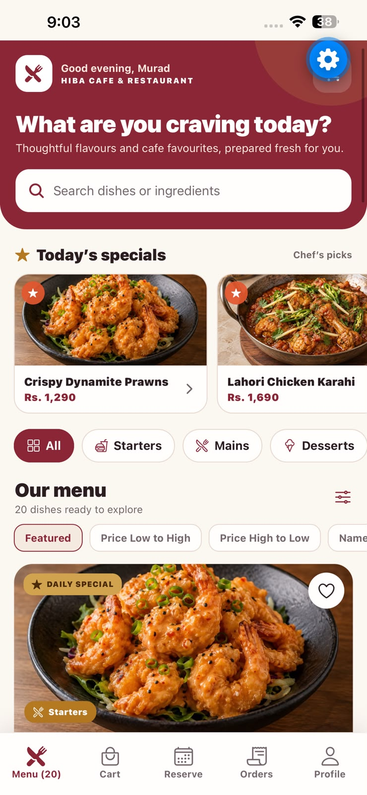
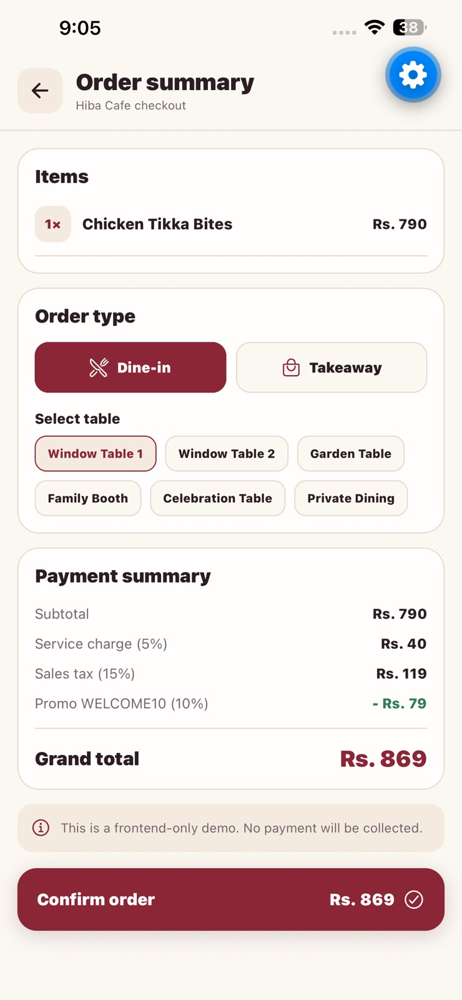
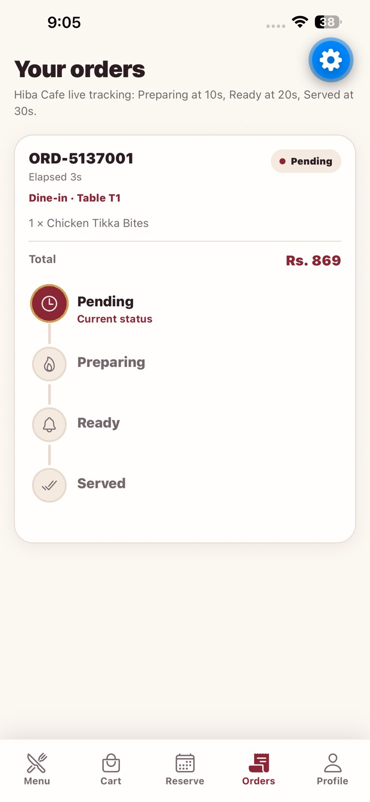
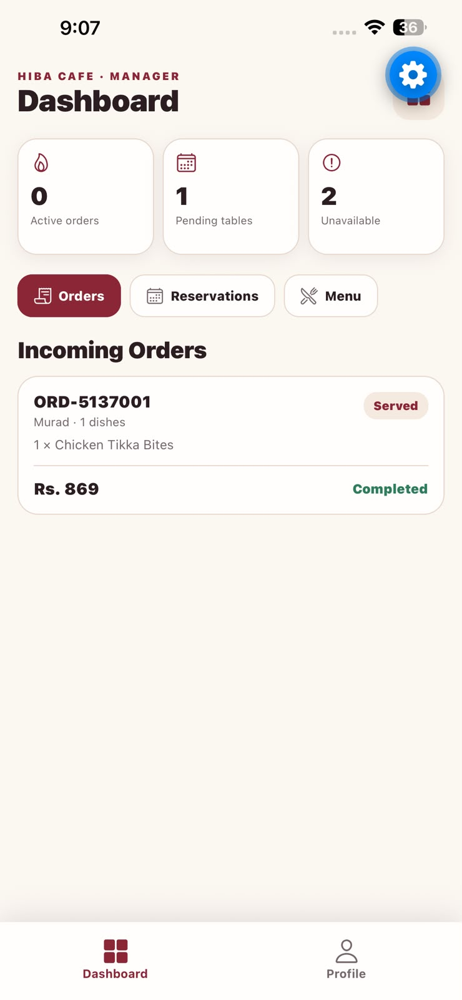

# 🍽️ Hiba Cafe & Restaurant

### Restaurant App MVP — React Native + Expo | Fall 2026

Hiba Cafe & Restaurant is a frontend-only React Native restaurant application featuring customer ordering, reservations, live order tracking, menu browsing, cart management, dark/light themes, and a dedicated manager dashboard.


---

## 🎥 Demo Video

### ▶️ Watch Full App Demo

[Open Hiba Cafe & Restaurant Demo Video](https://drive.google.com/file/d/1q1kv_G3RyhxadG5vpSram7Q3Rzq7cpan/view?usp=drive_link)

The demo covers the complete Customer and Manager workflow including authentication, menu browsing, search, cart, promo codes, order placement, tracking, reservations, themes, and restaurant management.

---

## 📱 App Preview

<table>
  <tr>
    <td align="center">
      <br>
      <b>Menu Experience</b>
    </td>
    <td align="center">
      <br>
      <b>Order Summary</b>
    </td>
  </tr>
  <tr>
    <td align="center">
      <br>
      <b>Live Order Tracking</b>
    </td>
    <td align="center">
      <br>
      <b>Manager Dashboard</b>
    </td>
  </tr>
</table>

### 🖼️ View All Screenshots

[Open the complete screenshots gallery](./screenshots)

The repository contains screenshots for authentication, menu browsing, search, sorting, cart, promo codes, order summary, reservations, profile and theme controls, order tracking, and the manager experience.

---

## 📖 About the Project

Hiba Cafe & Restaurant is a frontend-only restaurant app MVP created for the Fall 2026 Mobile Application Development assignment. It provides separate Customer and Manager experiences while demonstrating reusable components, React Hooks, Context API, reducer-based state management, local persistence, navigation, themes, and performance optimization.

All application behavior uses local or mock data, so the project is straightforward to review and run in Expo without server configuration.

## ✨ Key Features

### Customer

- Login and signup
- Role-based authentication
- 20-item menu with unique local food images
- Category filtering
- 400ms debounced search
- Recent searches
- Sorting
- Favourites
- Cart management
- Quantity controls
- Special instructions
- Promo codes
- Order summary
- Dine-in and takeaway ordering
- Table reservation
- Live order tracking
- Light and dark themes
- Profile and logout

### Manager

- Manager-only dashboard
- Incoming order management
- Reservation management
- Add menu items
- Edit prices
- Toggle availability
- Profile and logout
- Theme switching

## 👤 Demo Accounts

These credentials come directly from `src/data/users.js`:

| Role | Name | Email | Password |
|---|---|---|---|
| Customer | Ayesha Khan | `customer@example.com` | `Password123` |
| Manager | Hassan Ahmed | `manager@example.com` | `Manager123` |

## 🛠️ Technology Stack

| Technology | Purpose |
|---|---|
| React Native | Cross-platform mobile user interface |
| Expo SDK 57 | Development runtime and tooling |
| JavaScript | Components and application logic |
| React Navigation | Authentication, stack, and tab navigation |
| Context API | Shared authentication, theme, cart, order, reservation, and menu state |
| React Hooks | Local state, effects, refs, context, reducers, memoization, and callbacks |
| `useReducer` | Predictable action-based cart and order state transitions |
| AsyncStorage | Local persistence for orders, reservations, and menu edits |
| Ionicons | Consistent interface iconography |
| Local assets | Reliable bundled menu images without runtime downloads |

No backend, Firebase, external database, or payment API is used. This is a frontend-only assignment.

## 📂 Project Structure

```text
restaurant-app-mvp/
├── A1/
│   ├── SRS.pdf
│   └── UML/
├── assets/
│   └── menu/
├── screenshots/
├── src/
│   ├── components/
│   ├── constants/
│   ├── context/
│   ├── data/
│   ├── hooks/
│   ├── navigation/
│   ├── reducers/
│   ├── screens/
│   └── theme/
├── App.js
├── app.json
└── README.md
```

## 🚀 Installation

### Requirements

- Node.js 20.19 or newer
- npm
- Expo Go on a physical device, or an Android/iOS simulator

### Clone and run

```bash
git clone https://github.com/MURAD-KHAN1/restaurant-app-mvp.git
cd restaurant-app-mvp
npm install
npx expo start
```

Scan the QR code with Expo Go or select an available simulator from the Expo terminal.

### Windows PowerShell alternative

If PowerShell execution policy blocks the npm or npx wrapper scripts, use:

```powershell
npm.cmd install
npx.cmd expo start --clear
```

## ✅ Assignment Coverage — Q3 to Q10

| Question | Implementation evidence |
|---|---|
| Q3 | Login and signup forms demonstrate `useState`, validation, and role-aware authentication. |
| Q4 | Menu browsing uses `useState` and `useEffect` for interactive filtering and lifecycle behavior. |
| Q5 | Search and scroll controls use `useRef`, including non-rendering mutable references. |
| Q6 | Authentication and theme state use `useContext` to avoid deep prop drilling. |
| Q7 | Cart management uses `useReducer` for explicit, predictable actions. |
| Q8 | The order summary uses `useMemo`, `useCallback`, and `React.memo` for calculated values and render optimization. |
| Q9 | Table reservations use reusable custom hooks and validation logic. |
| Q10 | Order tracking, the Manager dashboard, and AsyncStorage complete the local MVP workflow. |

The Q1 Software Requirements Specification and Q2 UML deliverables remain in the `A1` folder.

## 🪝 React Hooks Used

| Hook | Purpose in the application |
|---|---|
| `useState` | Forms, search, filters, sorting, modal visibility, and local interface state |
| `useEffect` | Loading, timers, synchronization, and AsyncStorage persistence |
| `useRef` | Search input, list/scroll references, timers, and render-count evidence |
| `useContext` | Authentication, theme, cart, orders, reservations, and menu access |
| `useReducer` | Cart and order state management through named actions |
| `useMemo` | Menu filtering, sorting, pricing totals, and dashboard statistics |
| `useCallback` | Stable event handlers passed to child components |
| `React.memo` | Skipping unnecessary renders for suitable reusable components |
| `useForm` | Reusable form values, validation, and submission behavior |
| `useDebounce` | Applying the 400ms menu search delay |
| `useReservation` | Reservation availability, validation, creation, and cancellation logic |

## 🧠 Context API vs Prop Drilling

Authentication, theme, cart, orders, reservations, and menu state are required by components at different levels of the navigation tree. Context API keeps each shared concern in one source of truth and lets screens access it through focused hooks instead of forwarding the same values through intermediate components that do not use them.

This avoids deep prop drilling, reduces coupling, keeps component props focused, and makes role-based Customer and Manager navigation easier to maintain. The drawback is that a context update can re-render all subscribed consumers. The project limits that cost by separating contexts by responsibility and using memoization where it provides a measurable benefit.

## 🛒 useReducer vs useState

`useState` is appropriate for isolated values such as search text, input fields, or modal visibility. Cart state contains several related transitions that must remain consistent, so `useReducer` centralizes the rules, gives each transition an explicit action, and returns immutable state updates that are easier to test.

The cart reducer supports:

- `ADD_ITEM`
- `REMOVE_ITEM`
- `INCREMENT`
- `DECREMENT`
- `UPDATE_NOTE`
- `CLEAR_CART`
- `APPLY_PROMO`
- `REMOVE_PROMO`

The order reducer follows the same action-based principle for order creation and forward-only status updates.

## 🔄 useEffect Dependency Note

An effect with an empty dependency array runs only after the initial mount:

```javascript
useEffect(() => {
  // Runs once after mount.
}, []);
```

If an effect reads changing values such as a category, search query, menu list, or persistent state, those values must be included in its dependency array. Otherwise, filtering or saving can use stale values and fail to update when the user changes the interface. Cleanup functions are also required when an effect creates a timer, subscription, or listener.

## ⚡ Performance Optimization

The project uses React performance tools selectively:

- `React.memo` lets suitable menu, cart, and order components skip rendering when their props are unchanged.
- `useMemo` caches filtered and sorted menu results, order totals, and dashboard statistics until an input changes.
- `useCallback` preserves function references passed to memoized children until a dependency changes.
- `useRef` records diagnostic values without triggering an additional render.

### Before and after render behavior

| Scenario | Before optimization | After optimization |
|---|---|---|
| A parent screen updates | Child cards may render even when their displayed data is unchanged. | `React.memo` can skip children whose props are unchanged. |
| A handler is passed as a prop | A new function reference can invalidate memoization on every parent render. | `useCallback` keeps the reference stable until a dependency changes. |
| Filters or totals are derived | Calculations can repeat during unrelated renders. | `useMemo` recalculates only when an input changes. |

The repository includes a captured [search render-counter example](./screenshots/06-search-render-counter.jpeg) as render evidence. Dedicated `13-console-before.png` and `14-console-after.png` files are not linked because they are not present in the repository.

Memoization is used where it improves behavior; applying it indiscriminately would add complexity and its own comparison overhead.

## 💾 Local Persistence

AsyncStorage keeps selected application state available across app restarts:

- Orders
- Reservations
- Manager menu edits, including price, availability, and locally added items

These are the project's selected persistent state domains. Authentication, payments, and remote synchronization are not persisted through a server because the app is frontend-only.

## 🏷️ Promo Codes

| Promo code | Discount |
|---|---:|
| `WELCOME10` | 10% |
| `FEAST20` | 20% |

Invalid codes leave the cart discount unchanged and show validation feedback.

## 🧾 Order Summary

The cart and order-summary screens calculate and present:

```text
Subtotal
+ Service Charge (5%)
+ Sales Tax (15%)
- Promo Discount
= Grand Total
```

The summary also preserves the chosen order type, dine-in table or takeaway time, item quantities, special instructions, and applied promo code.

## 📍 Order Tracking

Orders progress forward through the local status sequence:

```text
Pending → Preparing → Ready → Served
```

For the demo, an active order advances to Preparing after 10 seconds, Ready after 20 seconds, and Served after 30 seconds. The Manager dashboard can also move an order to its next valid status.

## 📅 Table Reservation

Customers can select a date, party size, phone number, and available time slot, then create or cancel a reservation. Time slots cover `12:00` through `22:00`, and the accepted phone format is `03XX-XXXXXXX`. Reservations are visible to the Manager for approval or decline and are saved locally with AsyncStorage.

## 🧪 Cart Reducer Test Cases

| Action | Initial state | Expected state |
|---|---|---|
| `ADD_ITEM` with an available item | Empty cart | Item is added with quantity `1` and an empty note. |
| `ADD_ITEM` with the same item | Item already has quantity `1` | Existing item quantity becomes `2`; no duplicate row is created. |
| `ADD_ITEM` with an unavailable item | Cart contains any items | State remains unchanged. |
| `REMOVE_ITEM` | Target item exists | Only the target item is removed. |
| `INCREMENT` | Target quantity is `1` | Target quantity becomes `2`. |
| `DECREMENT` | Target quantity is `2` | Target quantity becomes `1`. |
| `DECREMENT` | Target quantity is `1` | Target item is removed instead of reaching quantity `0`. |
| `UPDATE_NOTE` | Target note is empty | Target item stores the supplied special instruction. |
| `CLEAR_CART` | Cart contains items and a promo | Items and promo values return to the initial state. |
| `APPLY_PROMO` with `WELCOME10` | No promo is active | Promo code becomes `WELCOME10` and discount becomes `10%`. |
| `APPLY_PROMO` with `FEAST20` | No promo is active | Promo code becomes `FEAST20` and discount becomes `20%`. |
| `REMOVE_PROMO` | A valid promo is active | Promo code is cleared and discount returns to `0%`. |

## 🎬 Application Flow

### Customer

```text
Login → Menu → Search/Filter → Cart → Promo → Order Summary → Dine-in/Takeaway → Order Tracking → Reservation → Profile
```

### Manager

```text
Login → Dashboard → Orders → Reservations → Menu Management → Profile
```

## 📚 Academic Documentation

The original assignment documents remain unchanged in the `A1` folder:

- [SRS Document](./A1/SRS.pdf)
- [UML Diagrams](./A1/UML)

The Software Requirements Specification defines the frontend-only scope, Customer and Manager roles, functional and non-functional requirements, local data model, and planned screens.

The UML folder contains:

- Use Case Diagram
- Class Diagram
- Sequence Diagram
- State Machine Diagram
- Component Diagram

Together, these files cover the assignment's Q1 requirements analysis and Q2 system modeling without duplicating the full documents in this README.

## 🔗 GitHub Repository

[github.com/MURAD-KHAN1/restaurant-app-mvp](https://github.com/MURAD-KHAN1/restaurant-app-mvp)

---

### Hiba Cafe & Restaurant
**Restaurant App MVP — Fall 2026**
Built with React Native & Expo.
